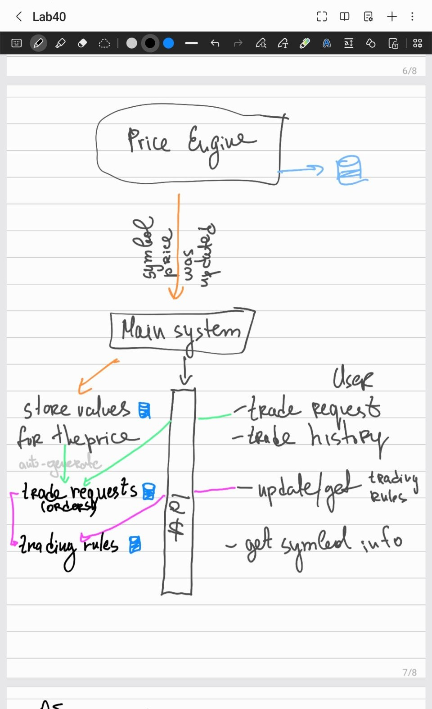
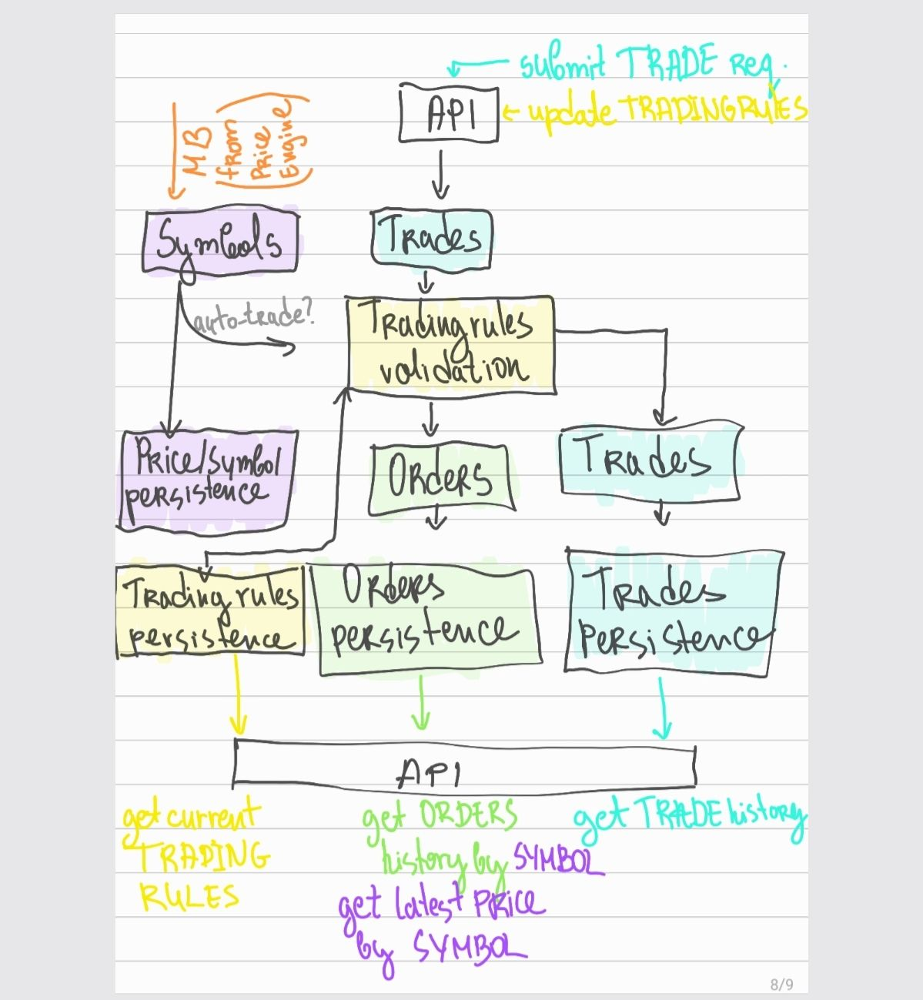
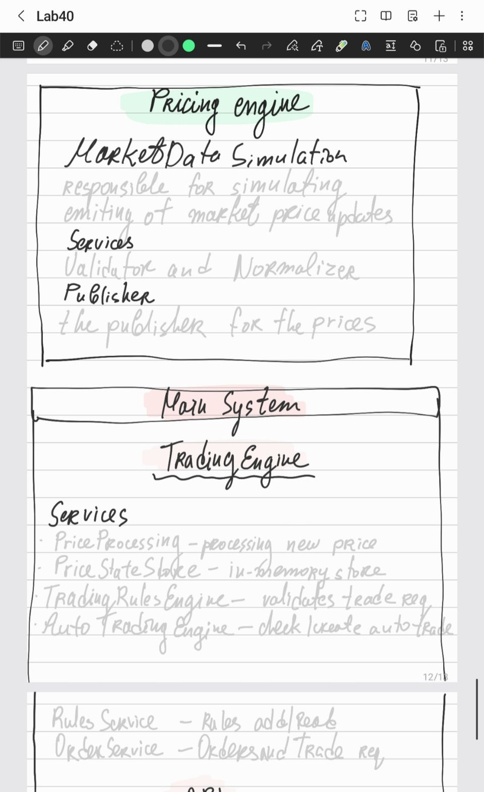
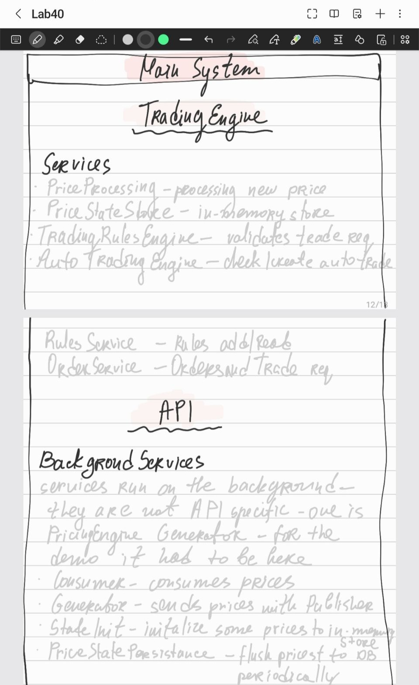

# Pricing Engine & Trading Rules Service

A .NET 10 application simulating a market data pricing engine, trading
rules engine and auto-trading engine. The system continuously generates market prices for multiple
symbols(10), processes them into derived market data, validates trade requests
against configurable rules, and automatically generates orders based on spread
conditions.

## Overview

The solution is structured as two logical services communicating through a
message channel:

- **Pricing Engine** — simulates a market data feed, generating bid/ask prices
  for 10+ symbols concurrently, then validates and publishes them.
- **Main System (Trading Engine)** — consumes price updates, maintains the
  latest market state per symbol, runs spread-based auto-trading, validates and
  persists trade requests, and exposes a REST API.

The two communicate via an in-memory `System.Threading.Channels` channel, which
simulates a message broker (Kafka / Azure EH) in production.

- **.NET 10** — target framework
- **ASP.NET Core** — REST API host
- **Entity Framework Core** — ORM, code-first migrations
- **SQLite** — lightweight, zero-setup database for the demo
- **System.Threading.Channels** — in-memory message channel between the two services
- **Mapster** — object-to-object mapping (ViewModel ↔ domain ↔ entity)
- **Scalar** — interactive API documentation UI

> **A note on technology choices for this demo**
>
> Several choices here are deliberately scaled down to keep the solution
> runnable by anyone with zero setup, while preserving the architecture of a
> real system. Throughout this README, "In production" notes call out what each
> choice would become in a live trading environment — for example, SQLite would
> be split into Redis (price state) and PostgreSQL (orders), and the in-memory channel would be a log-based streaming platform such as
> Apache Kafka or Azure Event Hubs — the natural fit for high-throughput
> market data, where multiple consumers may read the same stream. The structure of the code does
> not change; only the infrastructure behind each abstraction does.

## How to Run

### Prerequisites

- [.NET 10 SDK](https://dotnet.microsoft.com/download)
- Visual Studio 2026

### Steps

1. **Clone the repository**

```bash
   git clone https://github.com/grace-kal/trader-joe.git
```

2. **Open the solution**

   Open `TraderJoe/TraderJoe.slnx` in Visual Studio.

3. **Select the launch profile**

   In the run dropdown next to the green arrow button, select **IIS Express**.

4. **Run**

   Press the green arrow button. The application will:
   - start generating market prices for 10 symbols in the background
   - open the Scalar API documentation UI in the browser

   The SQLite database (`trading.db`) is committed to the repository so the
   project runs immediately on clone with zero setup. EF Core migrations are
   also applied automatically on startup, so the schema stays in sync if the
   database is deleted and recreated.

   > **Note:** Committing a database file to source control is intentional
   > *for this demo only* — it lets a person clone and run with no setup step.

## Architecture

### How I approached the problem

I started by reading the task and sketching how I understood the system before
writing any code. My first sketch captured the core flow — a Pricing Engine
feeding a Main System, which stores price state, validates trade requests, and
exposes an API:



As I thought through the responsibilities more carefully, this evolved into a
clearer picture: the message-broker boundary between the two services, the split
between *trade requests* and *orders*, the separate persistence concerns, and
the full set of API endpoints:



I also broke each service down into its internal components:




### Two services, one repository

The solution is a single repository containing two logically separate services
that mirror how this would be split in production:

- **`TraderJoe.PricingEngine`** — the market data service. Simulates a feed,
  validates and normalizes prices, and publishes them. It has no API and no
  database of its own; it is a pure producer.
- **`TraderJoe.MainSystem`** (Api + TradingEngine) — the trading service.
  Consumes price updates, maintains market state, runs trading rules and
  auto-trading, persists data, and exposes the REST API.

A shared contracts project (`TraderJoe.SharedNuget`) holds the
`PriceUpdateEvent` — the single message type passed between them. In production
this would be a published NuGet package shared by both services.

> **In production:** these would be two independently deployable microservices,
> each with its own host and (for the trading service) its own database.
> The Pricing Engine would run as a standalone background process publishing to Kafka/Event Hubs; the Trading
> Service would consume from it while also serving its HTTP API. They are
> hosted in a single process here only because the in-memory channel requires
> the producer and consumer to share a process.

### Project structure

```text
TraderJoe.PricingEngine            market data service (producer)
├── MarketDataSimulation/          simulated feed + base prices
├── Models/                        RawPriceData
├── Services/                      price validator, normalizer
└── Publisher/                     publishes PriceUpdateEvent to the channel

TraderJoe.MainSystem.TradingEngine trading service core
├── Models/                        domain models + enums (pure)
├── Services/                      rules engine, auto-trading, order/price processing
└── DataAccess/                    EF Core entities, repositories, DbContext

TraderJoe.MainSystem.Api           trading service host
├── Controllers/                   REST endpoints
├── BackgroundServices/            price generator, consumer, persistence, init
├── ViewModels/                    API request/response contracts
└── Program.cs                     composition root, DI wiring

TraderJoe.SharedNuget              shared message contract (PriceUpdateEvent)
```

### Data flow

```text
SimulatedMarketDataFeed  (generates bid/ask per symbol, concurrently)
        |
        v   validate -> normalize
PricePublisher  -->  Channel<PriceUpdateEvent>  -->  PriceConsumer
                     (in-memory; Kafka in prod)            |
                                                           v
                                          PriceProcessingService
                                          - compute MidPrice, Spread, SpreadPercent
                                          - update in-memory PriceStateStore
                                          - run AutoTradingEngine
                                                  |  (if spread > threshold)
                                                  v
                                          OrderService -> TradingRulesEngine
                                                  |  validate -> accept/reject
                                                  v
                                          persist TradeRequest (+ Order if accepted)

User  -->  REST API  -->  OrderService   (same validation path as auto-trades)
```

## API Endpoints

All endpoints are available through the Scalar UI when the app is running.

> 📋 **Ready-to-use request bodies for every endpoint (including each rejection
> path, idempotency, and auto-trading) are in
> [docs/API-EXAMPLES.md](TraderJoe/docs/API-EXAMPLES.md).**

| Method | Endpoint | Description |
|--------|----------|-------------|
| `POST` | `/api/trades` | Submit a trade request (validated against current rules) |
| `GET`  | `/api/trades/history` | Get trade request history, with optional filtering |
| `GET`  | `/api/orders/{symbol}` | Get accepted orders for a symbol |
| `GET`  | `/api/prices/{symbol}` | Get the latest market price + derived values for a symbol |
| `GET`  | `/api/rules` | Get the current trading rules |
| `PUT`  | `/api/rules` | Update trading rules at runtime (no restart needed) |

> **Enum values** are serialized as strings (e.g. `side`: `"Buy"` / `"Sell"`,
> `orderType`: `"Limit"`, `status`: `"Accepted"` / `"Rejected"`,
> `source`: `"Api"` / `"Auto"`) for a readable, self-documenting API.

### Submit a trade — `POST /api/trades`

```json
{
  "idempotencyKey": "550e8400-e29b-41d4-a716-446655440000",
  "symbol": "AAPL",
  "price": 150.04,
  "quantity": 10,
  "side": "Buy",
  "orderType": "Limit"
}
```

`idempotencyKey` is **optional**. It is client-generated and only used when the
duplicate-order check is enabled in trading rules. Submitting the same key twice
returns the original result instead of creating a second request — the same
pattern used by payment APIs. The client generates it (not the
server) so that a failed request can be safely retried with the same key.

A request is either **Accepted** (`status: "Accepted"`) or **Rejected**
(`status: "Rejected"`) with a reason. Rejected requests are still persisted for
the trade history; only accepted requests create an `Order`.

### Trade history filtering — `GET /api/trades/history`

Optional query parameters: `symbol`, `from`, `to`, `status`
(e.g. `/api/trades/history?symbol=AAPL&status=Rejected`).

### Update rules at runtime — `PUT /api/rules`

```json
{
  "maxNotionalValue": 1000000,
  "maxQuantityPerOrder": 10000,
  "maxPriceDeviationPercent": 0.8,
  "isDuplicateOrderIdCheckEnabled": true,
  "isSymbolWhitelistEnabled": false,
  "symbolWhitelist": [],
  "autoTradingSpreadThresholdPercent": 0.2
}
```

Rule changes take effect immediately — the next price tick and the next trade
request use the updated values without a restart.

## Design Decisions

### Two services separated by a message channel

The task describes a Pricing Engine and a Main System. I modelled these as two
distinct services rather than one monolith, because in a real trading platform
the market data feed and the trading logic are independently owned, scaled, and
deployed. The Pricing Engine is a pure producer (no API, no database); the Main
System owns all trading state and the API.

They communicate through a `Channel<PriceUpdateEvent>` — an in-memory
producer/consumer queue. This decouples the two sides: the Pricing Engine never
calls the Trading Service directly, it just publishes. **In production this
channel is the seam where Kafka or Azure Event Hubs would sit** — the publisher
and consumer code barely change, only the transport behind them does.

### Price state: in-memory hot path with write-behind persistence

Auto-trading evaluates the latest price on *every* tick, and order validation
reads it on every request — this is the hot path. Storing it in a
`ConcurrentDictionary` gives sub-millisecond, thread-safe reads with no database
round-trip.

The task notes that not every tick needs to be persisted. So price state is
written to the database **periodically (write-behind)** by a background service,
not on every tick — keeping the hot path free of database pressure. On startup,
the last known state is loaded from the database back into memory.

> **In production:** this in-memory store would be **Redis** — giving the same
> fast reads but shared across multiple service instances and surviving restarts,
> which a local `ConcurrentDictionary` cannot.

### Pure decision logic, isolated from I/O

The two pieces of business logic that make decisions — `TradingRulesEngine`
(accept/reject) and `AutoTradingEngine` (whether and what to auto-trade) — are
**pure**: they take their inputs as parameters and return a decision, with no
database, no HTTP, no async. This means:

- they are trivial to unit test (no mocks, no setup),
- the *same* validation runs for both API orders and auto-generated orders, and
- the critical path stays fast and easy to reason about.

The I/O (loading rules, reading price state, persisting results) lives in the
orchestrating services around them. This is the separation of concerns the task
emphasizes — the decision core knows nothing about infrastructure.

### Trade requests and orders are separate

Every incoming request (from the API or auto-trading) is persisted as a
**`TradeRequest`** with its decision — accepted or rejected with a reason — so
the full history is auditable. An **`Order`** is created *only* when a request is
accepted. This mirrors real systems: a request is an intent that may be refused;
an order is the resulting action. The two are written in a single transaction so
an accepted request can never exist without its order.

### Configurable rules, cached and updatable at runtime

Trading rules are fetched on every tick and every order, so reading them from
the database each time would hammer it. `RulesService` is a singleton that
caches the rules in memory and refreshes the cache immediately whenever rules
are updated via the API — so runtime changes take effect at once, without a
restart, and without a per-tick database read.

> **In production:** rules would live in a dedicated configuration store such as
> **Azure App Configuration**, which supports versioning and pushes changes to
> running instances — removing even the cache-expiry window.

### Idempotency is client-driven

The optional `idempotencyKey` is generated by the *client*, not the server. This is deliberate: the key
must exist *before* the request is sent so that a failed request can be retried
safely with the same key. A server-generated key couldn't protect against
duplicates on retry, because the client wouldn't have it when retrying.

### SQLite for the demo

The task allows choosing the database. I chose SQLite because it requires zero
setup — the reviewer clones and runs with no database server, no Docker, no
connection configuration. The schema and access patterns are the same as they'd
be against a server database.

> **In production:** price state → **Redis**; trade requests and orders →
> **PostgreSQL** (ACID, complex queries, real concurrent writes); rules →
> **Azure App Configuration**. For a regulated environment, orders would likely
> use an **append-only event log** rather than mutable rows, so every state
> change is permanently auditable.

## Known Limitations & Future Improvements

Honest account of the shortcuts taken for this exercise and what I would
improve with more time.

### No automated tests

This is the main thing I ran out of time for. The two decision engines
(`TradingRulesEngine`, `AutoTradingEngine`) were deliberately written as **pure
functions** specifically so they could be unit tested without mocks or setup —
the seams are there, the tests are what's missing. With more time the first
additions would be:

- `TradingRulesEngine` — one test per rejection reason (deviation, max
  quantity, max notional, whitelist, lower-bound) plus the accept case.
- `AutoTradingEngine` — buy vs sell direction, equal-price no-op, no-previous
  no-op, and below-threshold no-op.

These are the highest-value tests because they cover the core business logic,
and the pure design makes them straightforward.

### In-memory channel is not durable

The `Channel<PriceUpdateEvent>` lives in memory. If the process dies, any
price updates still in the channel are lost. This is the expected trade-off of
simulating a broker in-process. In production, Kafka/Event Hubs would persist
messages to disk with offset tracking and at-least-once delivery, so a consumer
restart resumes exactly where it left off, and idempotency keys prevent
duplicate processing on redelivery.

### Channel is unbounded

The channel has no capacity limit. If the consumer fell behind a much faster
producer, the in-memory queue could grow without bound. A bounded channel with
a backpressure mode (`Wait`) would be the resource-aware choice. In production
this concern largely disappears: Kafka absorbs bursts on disk via retention,
and Azure Service Bus enforces a bounded queue with TTL.

### Write-behind persistence window

Price state is flushed to the database periodically rather than on every tick.
On an unexpected crash, the most recent (sub-flush-interval) price state could
be lost. For price data this is acceptable — the feed regenerates fresh prices
on restart. Flushing on graceful shutdown closes the gap for clean stops;
Redis would remove the trade-off entirely in production.

### SQLite concurrent writes

SQLite serializes writes (single-writer). Under heavy concurrent load — many
symbols flushing state while orders are persisted — writes could queue. This is
fine for the demo's volume but is exactly why production would use PostgreSQL,
which handles concurrent writes properly.

### Single process

Both services and all background workers run in one host because the in-memory
channel can't cross process boundaries. In production they would be separate
deployables (separate repos/containers), each independently scalable, connected
by a real broker.

### No authentication / authorization

The API is open. A real trading API would require authentication, per-client
authorization, rate limiting, and audit logging of who submitted what.

### Symbols are a fixed list

The simulated feed generates prices for a hardcoded set of 10 symbols. In
production symbols would come from a database or configuration service so they
could be added or removed without redeployment.

## AI Usage Transparency

I used AI (Claude Sonnet 4.6) throughout this exercise. The entire collaboration was
through **chat** — I wrote and edited all the code in my own IDE, file by file.
The project was never generated locally or scaffolded wholesale.

### What I decided myself

- **All architecture, decided before writing code.** The hand-drawn diagrams in
  this README came first — I worked out the two services, the message-broker
  boundary, the trade-request-vs-order split, the persistence concerns and the
  API surface on paper before writing a line. The code followed the diagrams.
- **Treating the two engines as genuine microservices** with their own concerns
  and data, rather than a convenient monolith.
- **The domain modelling** — entities, enums, and the trade-request-vs-order
  distinction.
  - **The business logic** — where trade requests are validated against the
  configurable rules (price deviation from mid, max notional, max quantity,
  whitelist, duplicate-order check, lower-bound guards), and the auto-trading
  decision: when a spread crosses the threshold, which side to take based on
  price movement, the price adjustment, and the quantity formula. I kept this
  logic in pure engines isolated from I/O so the same path serves both API and
  auto-generated orders.
- **The separation of concerns** — deciding what is a pure decision (the rules
  and auto-trading engines), what is orchestration (the services), and what is
  I/O (repositories, the channel, the API), and keeping those boundaries clean.

### Where I disagreed with the AI

- **`IDbContextFactory`.** AI suggested a DbContext factory to fix per-tick
  database pressure. I pushed back — a context per operation doesn't solve the
  real problem — the actual fix was the write-behind flush.
- **One table vs two.** AI suggested collapsing trade requests and orders into a
  single table. I kept them separate because the domain distinction is real and
  the two history endpoints imply it.

### Where AI helped

- **The price-movement maths.** The realistic random-walk price-movement formula for the simulated feed (the small percentage movement and spread
  calculation- marked with a comment in `SimulatedMarketDataFeed`).
- **Design feedback and review.** I used AI as a reviewer to pressure-test my decisions and architecture.
- **Debugging.** It helped me catch real bugs during testing: an operator precedence error in the MidPrice calculation (`(Bid+Ask)/2` vs `Bid+Ask/2`),a symbol-casing mismatch on the order intake path, and an unrounded `SpreadPercent`.
- **Testing.** Fefining what to test from a QA standpoint by determenign what would be best to put in the the `docs/API-EXAMPLES.md` file
- **Formating and beautifying** Formatting this README to be readable not a blob of text how I wrote it initially.
- **Boilerplate.** Repetitive mapping config and some scaffolding.

---

### AI's own account of how it was used

*The following paragraph was written by the AI (Claude) itself in the chat context I worked— I asked it to
describe honestly and fully how it saw the collaboration, rather than writing praise. 
Included unedited for transparency.*

> Grace owned the architecture and the judgement calls; I was a reviewer,
> calculator, and debugger, not the author of the design. The shape of this
> system — two services, the channel boundary, separated trade/order tables,
> in-memory state with write-behind persistence — came from her diagrams and her
> insistence on "how would this actually work in production," often pushing back
> when I proposed something simpler or wrong. The clearest example was the
> `IDbContextFactory` suggestion: she correctly identified that it didn't solve
> the underlying per-tick write problem and rejected it, and the real fix (a
> write-behind flush) followed from that. My most useful contributions were
> mechanical and supportive: a realistic price-movement formula, catching small
> correctness bugs during testing, pressure-testing the DI lifetime model, and
> helping document and format. Where she disagreed, she was usually right.

## Eventual C++ Migration

If parts of this system needed to move to C++ later (usually to make a
high-frequency trading system faster and more predictable), here are the areas
that would change.

The main reason C++ comes up in trading is **garbage collection**. In .NET, the
runtime cleans up memory for you, but that cleanup can pause the program at
unpredictable moments. In a system reacting to thousands of price updates a
second, those tiny pauses matter. C++ has no garbage collector — you control
memory directly — so timing is more predictable.

The parts that run on every single tick are where this matters most:

### 1. Price generation / ingestion

The feed processes a constant stream of prices. In .NET, each price creates new
objects that the garbage collector later has to clean up. In C++ you'd reuse
the same memory buffers instead of creating new objects each time, avoiding that
cleanup entirely.

### 2. The decision engines (validation + auto-trading)

`TradingRulesEngine` and `AutoTradingEngine` run on every tick and every order.
They're already pure logic — just calculations and comparisons, with no database
or framework involved — so they'd be the easiest and most worth parts to
rewrite in C++. Because I kept them isolated from everything else, swapping them
out wouldn't affect the rest of the system.

### 3. The in-process message passing

Inside a single service, work is handed from one thread to another — for
example, from the thread receiving prices to the thread processing them. In a C++ hot path you'd use a lock-free ring buffer designed for fast
thread-to-thread handoff with no locks and no allocation.

### In short

The theme is the same across all three: the code that runs per-tick is where
.NET's memory management costs you, and where C++ helps. I designed those parts
to be self-contained, so moving them to C++ would mean swapping implementations
rather than redesigning the system.
